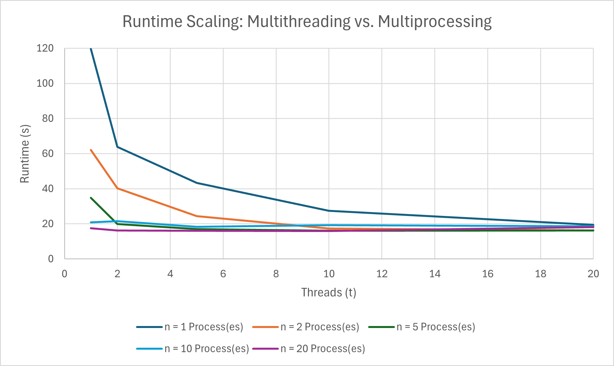

# System Programming Lab 11 – Multiprocessing
## CPE-2600 — Fall 2025  
**Author:** Jesse Rost  
**Section:** 112

---

## 1. Overview

This lab explores multiprocessing and multithreading by generating a sequence of Mandelbrot fractal images in parallel.
The provided `mandel` program renders one image; the new program **`mandelmovie`**:

- The calculation of each image is split into multiple regions.
- It uses pthreads to spin off the requested number of threads, with each thread calculating a different portion of the image.
- It accepts a new command-line option, typically -t, to set the number of threads for image calculation.
- Threads are ideal for this addition since threads typically share heap memory without additional overhead.
- This calculation is "embarrassingly parallel" because each pixel can be calculated independently.
- Uses `fork()` to spawn child processes  
- Uses `exec()` to run `./mandel`  
- Generates **50 frames**, zooming in on each one  
- Limits the number of concurrent children with `-n`  
- Parses command-line options using `getopt()`  
- Waits for all children before exiting  

The generated JPEG frames are later combined into a video using `ffmpeg`.

---

## 2. How `mandelmovie` Works

### Command Line Options
```
-n <children>   Maximum concurrent child processes
-t <threads>    Maximum number of threads being used
-x <value>      Mandelbrot center X-coordinate
-y <value>      Mandelbrot center Y-coordinate
-s <value>      Initial scale
-h              Show help
```

### Program Flow
1. Parse command-line options. This now includes parsing the maximum number of concurrent processes (-n) and the number of threads for image calculation (-t).
2. Loop through 50 frames.
3. If too many children are active, wait for one to finish. (Controlled by the -n option).
4. Fork a child:

   - Child computes scale, builds output filename, converts the thread count (-t) and other parameters to strings.

   - The child then runs ./mandel via execl(), passing all coordinates, scale, output filename, and the thread count as command-line arguments.
5. Parent continues spawning frames until all 50 are launched.
6. Parent waits for all remaining children at the end.

This achieves true multiprocessing and multithreading speedup on multi-core hardware.

---

## 3. Performance Results

| # Processes (n) | # Threads (t) | Runtime (s) |
|------------|------------|-------------|
| 1          | 1          |   119.668    |
| 1          | 2          |    63.897    |
| 1          | 5          |    43.273    |
| 1          | 10         |    27.511    |
| 1          | 20         |    19.510    |
| 2          | 1          |    62.085    |
| 2          | 2          |    40.218    |
| 2          | 5          |    24.352    |
| 2          | 10         |    17.427    |
| 2          | 20         |    16.205    |
| 5          | 1          |    34.836    |
| 5          | 2          |    19.872    |
| 5          | 5          |    17.027    |
| 5          | 10         |    16.096    |
| 5          | 20         |    16.289    |
| 10         | 1          |    20.907    |
| 10         | 2          |    21.561    |
| 10         | 5          |    18.326    |
| 10         | 10         |    19.234    |
| 10         | 20         |    18.593    |
| 20         | 1          |    17.449    |
| 20         | 2          |    16.310    |
| 20         | 5          |    16.022    |
| 20         | 10         |    15.900    |
| 20         | 20         |    18.209    |



---

## 4. Discussion

Optimal performance (the "sweet spot") is achieved by maximizing the use of the available CPU resources through a combination of both techniques. The runtime drops to its absolute minimum when the total number of concurrent tasks (Processes × Threads) approaches the number of logical cores available on the system, which in this case occurs around 10 threads per process at a high process count (n = 20,t = 10). Adding more threads or processes past this point introduces diminishing returns and ultimately increasing overhead (as seen in the n = 20, t = 20 result).

---

## 5. Movie Generation

After generating the 50 frames:

```
ffmpeg -framerate 30 -i frame_%02d.jpg mandel.mp4
```

The output video (`mandel.mpg`) is included in the repository.

---

## 6. Build & Run Instructions

### Build:
```
make
```

### Run examples:
```
./mandelmovie -n 10 -t 10
./mandelmovie -n 5 -t 5 -x -0.5 -y -0.5 -s 2.0
```

---

## 7. Git Workflow (Required)

```
git checkout -b lab12dev
git push --set-upstream origin lab12dev

# After development:
git checkout main
git merge lab12dev
git push

git tag Lab12vFinal
git push --tags
```

---

## 8. Repository Contents

- `mandelmovie.c`
- `mandelmovie.h`
- `mandel.c`
- `frame_00.jpg` … `frame_49.jpg`
- `mandel.mp4`
- `multithreadingVisual.png`
- `README.md`

