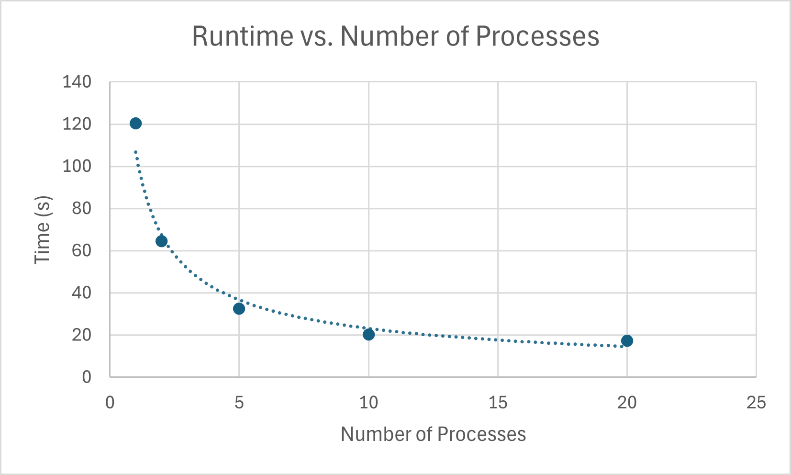

# System Programming Lab 11 – Multiprocessing
## CPE-2600 — Fall 2025  
**Author:** Jesse Rost  
**Section:** 112

---

## 1. Overview

This lab explores **multiprocessing** by generating a sequence of Mandelbrot fractal images in parallel.  
The provided `mandel` program renders one image; the new program **`mandelmovie`**:

- Uses `fork()` to spawn child processes  
- Uses `exec()` to run `./mandel`  
- Generates **50 frames**, zooming in on each one  
- Limits the number of concurrent children with `-n`  
- Parses command-line options using `getopt()`  
- Waits for all children before exiting  

The generated JPEG frames are later combined into a video using `ffmpeg`.

---

## 2. How `mandelmovie` Works

### Command Line Options
```
-n <children>   Maximum concurrent child processes
-x <value>      Mandelbrot center X-coordinate
-y <value>      Mandelbrot center Y-coordinate
-s <value>      Initial scale
-h              Show help
```

### Program Flow
1. Parse command-line options.  
2. Loop through 50 frames.  
3. If too many children are active, wait for one to finish.  
4. Fork a child:
   - Child computes scale, builds output filename, and runs `./mandel` via `execl()`.
5. Parent continues spawning frames until all are launched.
6. Parent waits for all remaining children at the end.

This achieves true multiprocessing speedup on multi-core hardware.

---

## 3. Performance Results

| # Processes | Runtime (s) |
|------------|--------------|
| 1          |   120.383    |
| 2          |    64.523    |
| 5          |    32.552    |
| 10         |    20.250    |
| 20         |    17.392    |



---

## 4. Discussion

Using more processes improves performance up to the number of physical CPU cores.  
Beyond that point, speedup flattens due to scheduling overhead and CPU contention.  
This shows that multiprocessing helps, but only to a practical limit.

---

## 5. Movie Generation

After generating the 50 frames:

```
ffmpeg -framerate 30 -i frame_%02d.jpg mandel.mp4
```

The output video (`mandel.mp4`) is included in the repository.

---

## 6. Build & Run Instructions

### Build:
```
make
```

### Run examples:
```
./mandelmovie -n 10
./mandelmovie -n 5 -x -0.5 -y -0.5 -s 2.0
```

---

## 7. Git Workflow (Required)

```
git checkout -b labWeek11dev
git push --set-upstream origin labWeek11dev

# After development:
git checkout main
git merge labWeek11dev
git push

git tag vFinal
git push --tags
```

---

## 8. Repository Contents

- `mandelmovie.c`
- `mandelmovie.h`
- `mandel.c`
- `frame_00.jpg` … `frame_49.jpg`
- `mandel.mp4`
- `runtime_graph.png`
- `README.md`

